# CDBL Leave Management System - Flow Charts

This document contains visual flow charts for all major workflows in the system, using Mermaid diagrams.

---

## 1. Leave Application Flow

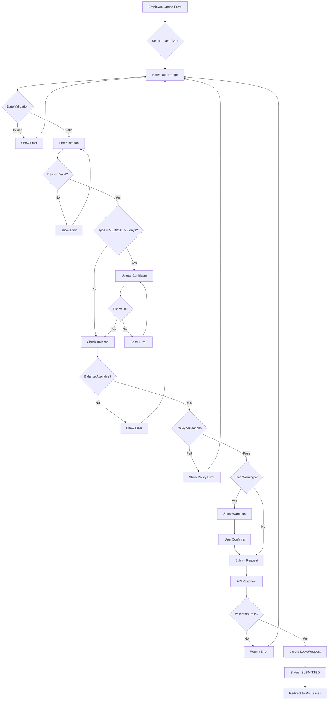

---

## 2. Approval Workflow State Machine

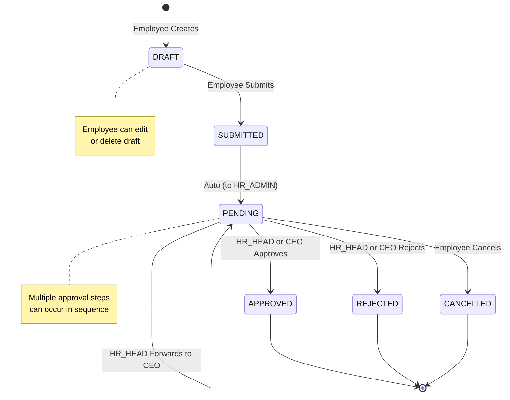

---

## 3. Approval Chain Flow

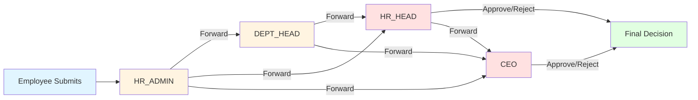

---

## 4. Authentication Flow

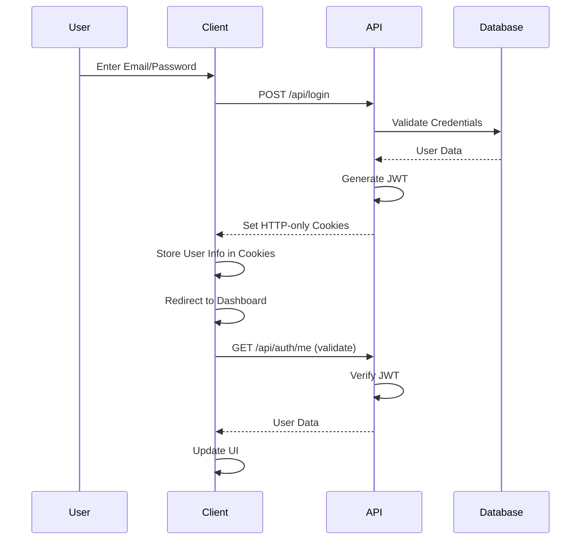

---

## 5. Balance Calculation Flow

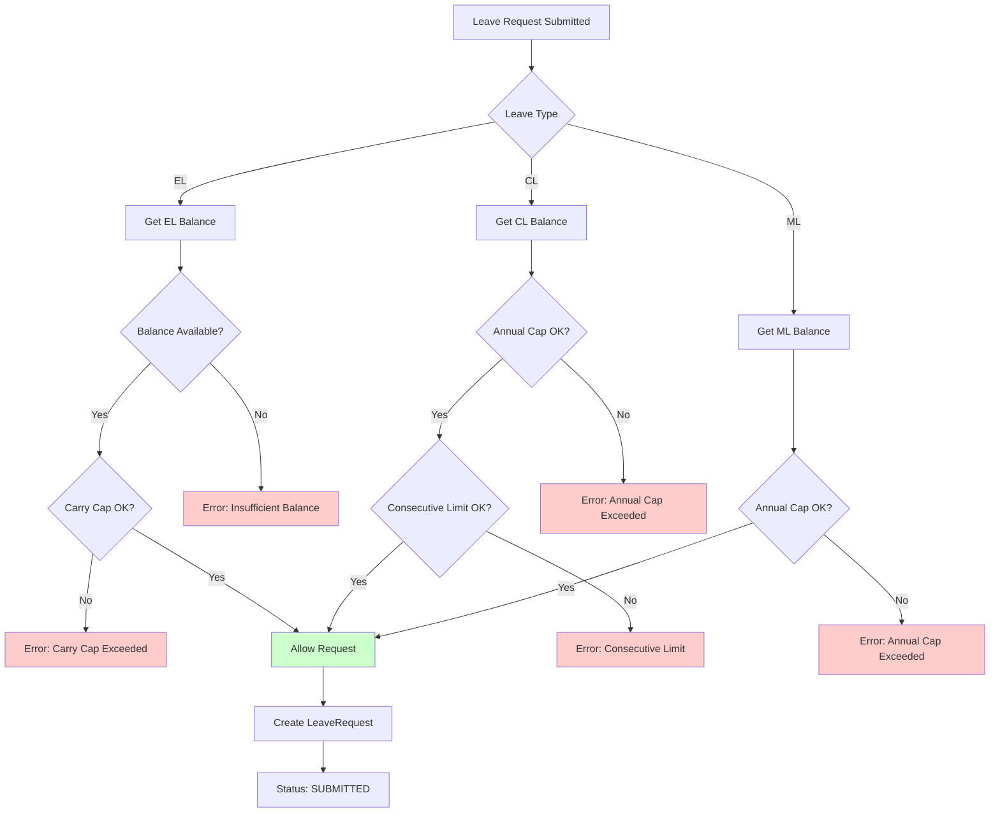

---

## 6. Policy Validation Flow

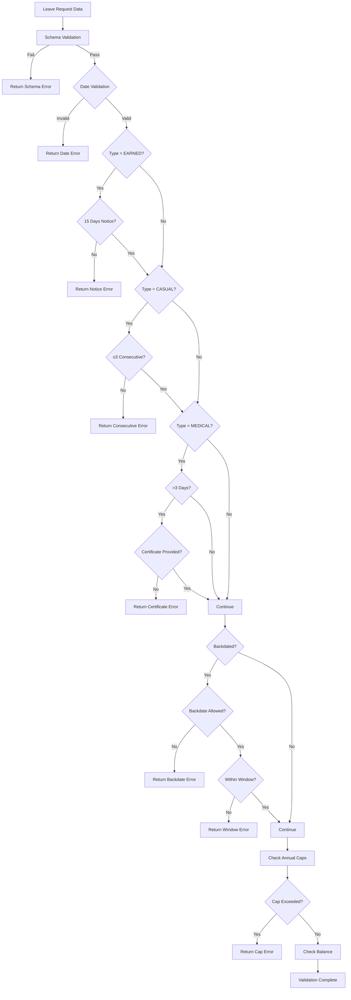

---

## 7. Cancellation Flow

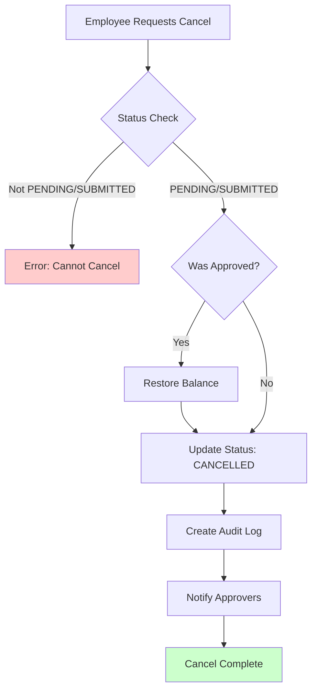

---

## 8. File Upload Flow

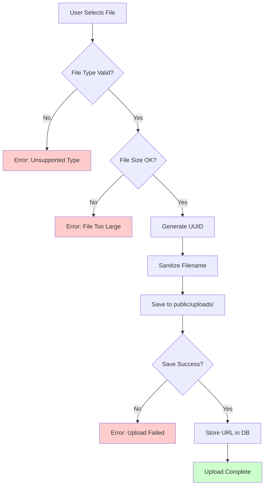

---

## 9. Error Handling Flow

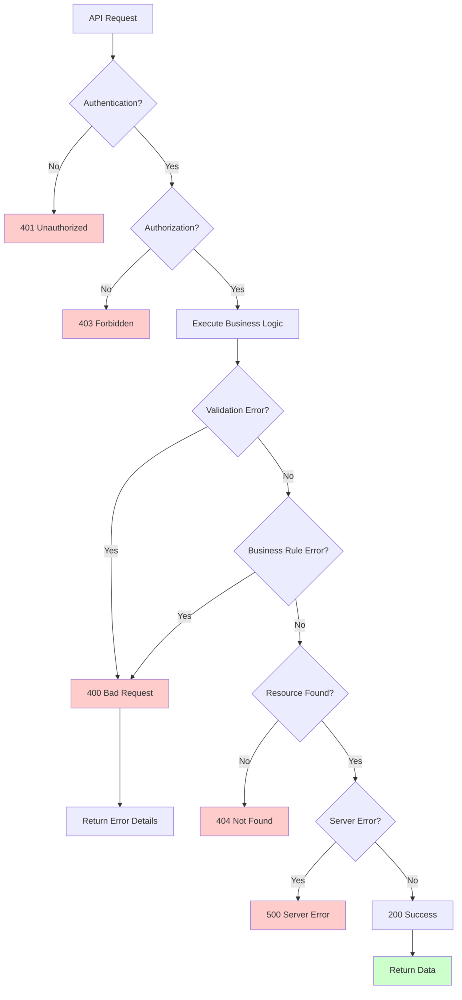

---

## 10. Date Validation Flow

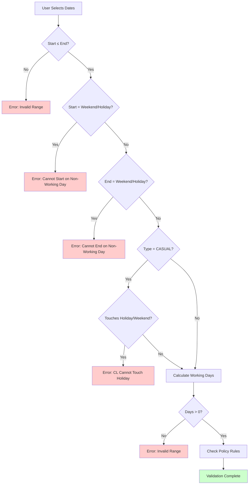

---

## 11. Holiday Detection Flow

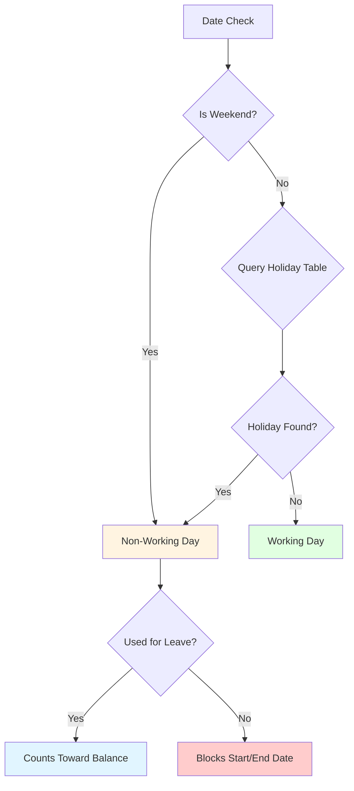

---

## 12. Role-Based Access Flow

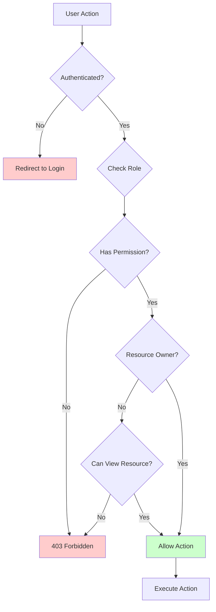

---

## Related Documentation

- **Approval Workflow**: [Policy Logic - Approval Workflow](./Policy%20Logic/06-Approval-Workflow-and-Chain.md)
- **Leave Application**: [Policy Logic - Application Rules](./Policy%20Logic/02-Leave-Application-Rules-and-Validation.md)
- **System Functionality**: [System Functionality](./05-System-Functionality.md)

---

**Document Version**: 1.0  
**Last Updated**: Current  
**Total Flow Charts**: 12 diagrams

