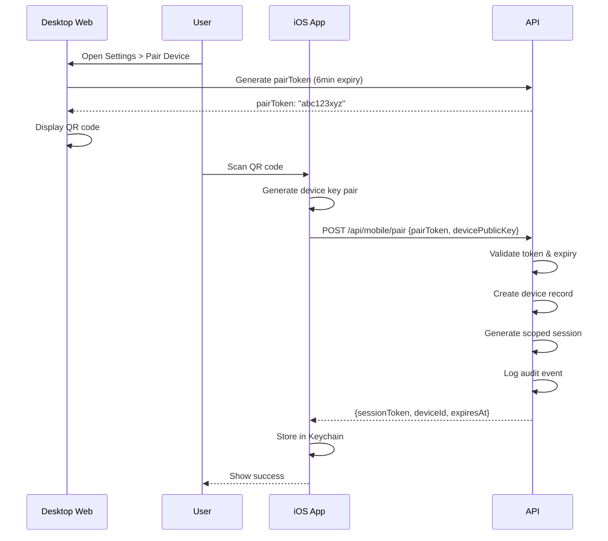

# Pairing and Sync Strategy — CDBL iOS App

**Version**: 1.0  
**Last Updated**: 2025-01-30  
**Status**: ✅ Implemented (QRFramer, QRAssembler, SnapshotImporter)

---

## 📋 Overview

This document defines the pairing and synchronization strategy between the iOS companion app and the desktop web application. The system must support both **online pairing** (default) and **air-gapped workflows** (employees without internet access).

### Key Constraints

- **Employees-only**: No public signup
- **Desktop source of truth**: Leave management is primarily web-based
- **Asia/Dhaka timezone**: All dates normalized to local timezone
- **Minimize PII**: Short-lived tokens, full audit trail
- **Offline-first**: App should work without network

---

## 🔗 Pairing Mechanisms

### A. QR Pairing (Online, Default)

**Use Case**: Employee with internet access, wants real-time sync

**Flow**:

```
Desktop Web App                iOS App                 Web API
─────────────────────────────────────────────────────────────────
1. User opens Settings
   → Generate pairing token
2. Display QR code (6–10min)
3. User scans QR
4. Parse token
5. POST /api/mobile/pair
   {pairToken, devicePublicKey}
                                 6. Validate token
                                 7. Return scoped session
                                 8. Device ID stored
                                 9. Audit log created
10. Display success
```

**Sequence Diagram**:



**Token Details**:

```swift
struct PairToken: Codable {
    let token: String      // 32-char random hex
    let expiresAt: Date    // +6 minutes from creation
    let userId: Int        // From authenticated session
    let devicePublicKey: String  // From iOS device
}

struct PairingResponse: Codable {
    let sessionToken: String    // JWT, 7-day expiry
    let deviceId: String        // UUID for this device
    let expiresAt: Date
    let refreshToken: String?   // Optional, 30-day expiry
}
```

**Security**:
- Pair token: Single-use, 6-minute expiry
- Scoped session: Device-bound, limited permissions
- Audit trail: All pairing events logged with IP, user, device

---

### B. Air-Gapped JSON Pass (Offline)

**Use Case**: Employee without internet access, needs offline leave management

**Flow**:

```
Desktop Web App                iOS App                 File System
─────────────────────────────────────────────────────────────────
1. User exports JSON snapshot
2. Digital signature added
3. Save to Downloads
4. User transfers file
   (AirDrop/USB/MDM)
                                 5. Import file
                                 6. Verify signature
                                 7. Extract data
                                 8. Warm-cache
                                 9. Enable read-only
10. Create leave request
11. Export signed delta
12. Transfer back to desktop
13. Desktop validates
14. Desktop uploads to server
```

**Snapshot Format**:

```swift
struct AirGapSnapshot: Codable {
    let version: String  // "1.0"
    let timestamp: Date
    let userId: Int
    let employee: EmployeeProfile
    let balances: LeaveBalance
    let holidays: [Holiday]
    let recentRequests: [LeaveRequest]  // Last 30 days
    let policyVersion: String  // "v2.0"
    let signature: String  // HMAC-SHA256
}

struct AirGapDelta: Codable {
    let sourceSnapshotId: String  // UUID of source
    let changes: [Change]
    let signature: String
}

enum Change {
    case createLeave(request: LeaveRequest)
    case updateStatus(requestId: UUID, status: LeaveStatus)
}
```

**Signature Verification**:

```swift
class AirGapValidator {
    func verifySnapshot(_ snapshot: AirGapSnapshot) throws -> Bool {
        // Extract data (excluding signature)
        let data = try JSONEncoder().encode(
            AirGapSnapshot(
                version: snapshot.version,
                timestamp: snapshot.timestamp,
                userId: snapshot.userId,
                employee: snapshot.employee,
                balances: snapshot.balances,
                holidays: snapshot.holidays,
                recentRequests: snapshot.recentRequests,
                policyVersion: snapshot.policyVersion,
                signature: ""  // Excluded from signing
            )
        )
        
        // Verify signature using shared secret (from user profile)
        let key = try getSharedSecret(for: snapshot.userId)
        let computed = HMAC<SHA256>.authenticationCode(for: data, using: key)
        let provided = Data(hexString: snapshot.signature)
        
        return computed.data == provided
    }
}
```

**Security**:
- Server-side signature verification required
- Replay attacks prevented by timestamp + sourceSnapshotId
- Delta packages must reference valid snapshot

---

### C. Multi-Frame QR Delta (Advanced)

**Use Case**: Large delta sync, rotating QR codes for chunked data

**Flow**:

```
Desktop → Generate delta
       → Split into frames
       → Rotate frames on-screen
       
iOS    → Scan frame 1/N
       → Scan frame 2/N
       → ...
       → Scan frame N/N
       → Verify CRC
       → Reassemble delta
       → Apply changes
```

**Implementation**:

```swift
struct QRFrame: Codable {
    let frameNumber: Int
    let totalFrames: Int
    let data: String  // Base64-encoded chunk
    let crc: UInt32   // Checksum for this frame
    let sequenceHash: String  // Hash of entire sequence
}

class MultiFrameQRDecoder {
    private var receivedFrames: [Int: QRFrame] = [:]
    
    func addFrame(_ frame: QRFrame) throws {
        // Verify CRC
        let computedCRC = calculateCRC(frame.data)
        guard computedCRC == frame.crc else {
            throw QRDecodeError.corruptedFrame(frame.frameNumber)
        }
        
        receivedFrames[frame.frameNumber] = frame
        
        if receivedFrames.count == frame.totalFrames {
            try assemble()
        }
    }
    
    private func assemble() throws {
        // Sort by frame number
        let sortedFrames = receivedFrames.sorted { $0.key < $1.key }
        
        // Reassemble data
        let dataString = sortedFrames.map { $0.value.data }.joined()
        
        // Verify sequence hash
        let computedHash = SHA256.hash(data: dataString)
        guard computedHash.hexString == sortedFrames[0].value.sequenceHash else {
            throw QRDecodeError.sequenceMismatch
        }
        
        // Decode delta
        guard let deltaData = Data(base64Encoded: dataString) else {
            throw QRDecodeError.invalidData
        }
        
        let delta = try JSONDecoder().decode(AirGapDelta.self, from: deltaData)
        return delta
    }
}
```

---

## 🔄 Sync Architecture

### Sync Components

```swift
// Services/Sync/SyncService.swift

class SyncService {
    let repository: LeaveRepository
    let conflictResolver: ConflictResolver
    let offlineQueue: OfflineQueue
    
    enum SyncStrategy {
        case online       // Real-time via API
        case offline      // Air-gap mode only
        case hybrid       // Online with offline fallback
    }
    
    func sync(strategy: SyncStrategy) async throws -> SyncResult {
        switch strategy {
        case .online:
            return try await syncOnline()
        case .offline:
            return try await syncOffline()
        case .hybrid:
            // Try online first, fallback to offline
            do {
                return try await syncOnline()
            } catch {
                return try await syncOffline()
            }
        }
    }
    
    private func syncOnline() async throws -> SyncResult {
        // Fetch from API
        let balances = try await apiClient.getBalances()
        let leaves = try await apiClient.getLeaves()
        let holidays = try await apiClient.getHolidays()
        
        // Resolve conflicts
        let resolved = try conflictResolver.resolve(local: localData, remote: (balances, leaves, holidays))
        
        // Apply changes
        try await applyChanges(resolved)
        
        return SyncResult(syncedItems: resolved.changes.count)
    }
}
```

### Conflict Resolution

```swift
// Services/Sync/ConflictResolver.swift

class ConflictResolver {
    func resolve(local: LocalState, remote: RemoteState) throws -> ResolvedState {
        var changes: [SyncChange] = []
        
        // Balance conflicts
        for (type, localBalance, remoteBalance) in zip(local.balances, remote.balances) {
            if localBalance != remoteBalance {
                // Server wins for balances
                changes.append(.updateBalance(type: type, value: remoteBalance))
            }
        }
        
        // Leave request conflicts
        for localRequest in local.leaves {
            let remoteRequest = remote.leaves.first { $0.id == localRequest.id }
            
            if let remote = remoteRequest {
                // Status changed on server
                if localRequest.status != remote.status {
                    changes.append(.updateStatus(id: remote.id, status: remote.status))
                }
                
                // Version conflict (edited both sides)
                if localRequest.version != remote.version {
                    // Server wins with timestamp-based merge
                    changes.append(.updateLeave(request: remote))
                }
            } else {
                // Local-only request (pending export)
                changes.append(.keepLocal(request: localRequest))
            }
        }
        
        return ResolvedState(changes: changes)
    }
}
```

### Offline Queue

```swift
// Services/Sync/OfflineQueue.swift

class OfflineQueue {
    let storage: CoreData
    
    func queue(_ action: OfflineAction) async throws {
        let queued = QueuedAction(
            id: UUID(),
            action: action,
            createdAt: Date(),
            retryCount: 0
        )
        
        try storage.save(queued)
    }
    
    func flush() async throws {
        let queued = try storage.fetchPending()
        
        for action in queued {
            do {
                try await execute(action)
                try storage.delete(action)
            } catch {
                action.retryCount += 1
                
                if action.retryCount > maxRetries {
                    try storage.markFailed(action)
                }
            }
        }
    }
    
    private func execute(_ action: QueuedAction) async throws {
        switch action.action {
        case .createLeave(let request):
            try await apiClient.createLeave(request)
        case .updateStatus(let id, let status):
            try await apiClient.updateLeaveStatus(id, status)
        // ...
        }
    }
}
```

---

## 🔐 Token Lifetime & Revocation

### Token Lifetimes

| Token Type | Lifetime | Refreshable? | Revocable? |
|------------|----------|--------------|------------|
| Pair Token | 6 minutes | No | N/A (single-use) |
| Session Token | 7 days | Yes | Yes |
| Refresh Token | 30 days | No | Yes |
| Air-Gap Snapshot | 24 hours | No | N/A |

### Revocation Flow

```swift
// Services/Pairing/DeviceUnlink.swift

class DeviceUnlinkService {
    func unlinkDevice(_ deviceId: String) async throws {
        // Revoke refresh token
        try await apiClient.revokeDevice(deviceId)
        
        // Clear local session
        try keychainStore.delete(sessionToken)
        try coreData.delete(deviceRecord)
        
        // Redirect to pairing screen
        NotificationCenter.default.post(name: .deviceUnlinked, object: nil)
    }
    
    func handleRemoteRevocation() {
        // Server-initiated revocation (security breach)
        keychainStore.deleteAll()
        coreData.deleteAll()
        
        // Show security alert
        NotificationCenter.default.post(name: .securityBreach, object: nil)
    }
}
```

---

## 📊 Audit Trail

### Audit Events

```swift
enum AuditEvent: String {
    case devicePaired = "DEVICE_PAIRED"
    case deviceUnlinked = "DEVICE_UNLINKED"
    case snapshotExported = "SNAPSHOT_EXPORTED"
    case snapshotImported = "SNAPSHOT_IMPORTED"
    case deltaExported = "DELTA_EXPORTED"
    case deltaImported = "DELTA_IMPORTED"
    case syncCompleted = "SYNC_COMPLETED"
    case syncFailed = "SYNC_FAILED"
}

struct AuditLog {
    let event: AuditEvent
    let userId: Int
    let deviceId: String
    let timestamp: Date
    let ipAddress: String?
    let metadata: [String: Any]
}
```

### Implementation

All pairing and sync operations must log audit events server-side:

```typescript
// app/api/mobile/pair/route.ts

export async function POST(req: Request) {
    // ... pairing logic
    
    await prisma.auditLog.create({
        data: {
            actorEmail: user.email,
            action: "DEVICE_PAIRED",
            targetEmail: user.email,
            details: {
                deviceId,
                ip: req.headers.get("x-forwarded-for"),
                platform: "iOS",
                deviceModel: deviceInfo.model
            }
        }
    });
    
    return NextResponse.json({ sessionToken, deviceId });
}
```

---

## 🔄 Conflict Handling Policy

### Conflict Scenarios

| Scenario | Resolution | Client Action |
|----------|------------|---------------|
| Balance mismatch | Server wins | Overwrite local |
| Leave status changed | Server wins | Update local |
| Leave edited both sides | Timestamp wins | Merge if possible, else server wins |
| Local-only request | Keep local | Queue for export |
| Remote-only request | Keep remote | Fetch and store |
| Holiday mismatch | Server wins | Overwrite local |
| Policy version mismatch | Server wins | Update local config |

### User Notification

```swift
class ConflictNotifier {
    func notifyConflicts(_ conflicts: [Conflict]) async {
        for conflict in conflicts {
            let message = switch conflict.type {
            case .balance:
                "Your leave balances have been updated from the server."
            case .statusChange:
                "Your leave request status has been updated."
            case .mergeRequired:
                "Your local changes conflicted with server. Server version kept."
            }
            
            await showAlert(title: "Sync Conflict", message: message)
        }
    }
}
```

---

## ✅ Testing

### Pairing Tests

```swift
class PairingTests: XCTestCase {
    func testQRPairing_SuccessFlow() async throws {
        // Generate token
        let token = try pairService.generateToken()
        
        // Scan QR
        let response = try await pairService.scanQR(token)
        
        XCTAssertNotNil(response.sessionToken)
        XCTAssertNotNil(response.deviceId)
    }
    
    func testQRPairing_ExpiredToken() async throws {
        let token = PairToken(
            token: "expired",
            expiresAt: Date().addingTimeInterval(-3600)
        )
        
        do {
            _ = try await pairService.scanQR(token)
            XCTFail("Should throw expired error")
        } catch PairingError.tokenExpired {
            // Expected
        }
    }
}
```

---

**Document Status**: ✅ Complete (Design Phase)  
**Implementation Status**: ❌ Not Started  
**Last Reviewed**: 2025-01-30

