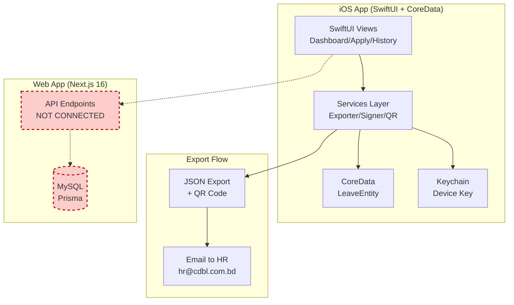

# Current State Map — CDBL iOS App

**Last Updated**: 2025-01-30  
**Audit**: v1.0

## 📋 Executive Summary

The CDBL Leave Companion iOS app is a **functional offline prototype** with **significant gaps** in API integration and policy compliance. The codebase is **well-structured** with SwiftUI + CoreData architecture, but **zero test coverage** and **blocking issues** that prevent production deployment.

### Key Findings

**✅ Strengths**:
- Clean SwiftUI architecture with proper separation of concerns
- Offline-first design with CoreData persistence
- Strong security model (HMAC-SHA256 signing, Keychain storage)
- iOS 26 Liquid Glass UI implementation
- Comprehensive UI components and design system

**❌ Critical Issues**:
- iOS 26.0 deployment target (doesn't exist — iOS 18 is latest stable)
- No API integration (mock data only)
- Policy validation mismatch (EL notice shows 15 days, should be 5 working days)
- Missing holiday integration
- Zero test coverage
- No accessibility support

---

## 🗺️ System Overview



### Current Data Flow

**Leave Creation Flow** (✅ Working):
```
User Input → LeaveFormView → Validate → CoreData → Export → Email/Share
```

**Balance Sync Flow** (❌ Not Implemented):
```
BalanceService.fetchBalances() → Mock Data → In-Memory Cache
```

**QR Pairing Flow** (❌ Not Implemented):
```
QRScannerView → Parse QR → Verify Signature → Store in CoreData
```

---

## 📊 Screen-by-Screen Matrix

| Screen | Present? | Works? | Gaps | Blockers |
|--------|----------|--------|------|----------|
| **Dashboard** | ✅ | ⚠️ Partial | Mock balances, no real data | No balance API |
| **LeaveFormView** | ✅ | ⚠️ Partial | Policy mismatches, no holiday validation | Fix policy constants |
| **HistoryView** | ✅ | ✅ Yes | No sync, no API updates | Need /api/leaves GET |
| **LeaveRequestDetailView** | ✅ | ✅ Yes | No timeline, no actions | N/A |
| **ConfirmationView** | ✅ | ✅ Yes | Email only, no sync | N/A |
| **QRScannerView** | ✅ | ❌ No | No pairing endpoint | Need /api/mobile/pair |
| **EmployeeProfileCard** | ✅ | ⚠️ Partial | Mock profile data | N/A |
| **BalanceProgressCard** | ✅ | ⚠️ Partial | Mock balances | No balance API |
| **Policy Validation** | ⚠️ Partial | ⚠️ Partial | EL notice wrong, no holidays | Fix constants, add holidays |
| **Date Picker** | ✅ | ⚠️ Partial | Can select Fri/Sat, no holidays | Add validation |
| **File Upload** | ✅ | ✅ Yes | No size validation | N/A |
| **Settings** | ❌ | ❌ | Not implemented | N/A |

**Legend**: ✅ = Complete | ⚠️ = Partial/Incomplete | ❌ = Missing/Broken

---

## 🔌 API Touchpoints Table

| Endpoint | Used? | Auth Required | Payload In | Payload Out | Error Keys | Status |
|----------|-------|---------------|------------|-------------|------------|--------|
| `/api/login` | ❌ | No | email, password | user, jwt | unauthorized | Not wired |
| `/api/auth/me` | ❌ | Yes (JWT) | none | user | unauthorized | Not wired |
| `/api/balance/mine` | ❌ | Yes | none | {year, EARNED, CASUAL, MEDICAL} | unauthorized | Expected, not wired |
| `/api/leaves` GET | ❌ | Yes | query params | {items[]} | unauthorized | Expected, not wired |
| `/api/leaves` POST | ❌ | Yes | {type, dates, reason} | leaveRequest | el_insufficient_notice, etc. | Expected, not wired |
| `/api/leaves/[id]` PATCH | ❌ | Yes | {status, reason} | updated | invalid_status | Not expected yet |
| `/api/holidays` | ❌ | Maybe | none | holidays[] | unauthorized | NEEDED |
| `/api/mobile/pair` | ❌ | TBD | {pairToken, deviceId} | {session, expiresAt} | invalid_token | NOT IMPLEMENTED |
| `/api/notifications/latest` | ❌ | Yes | none | notifications[] | unauthorized | Not expected yet |

**Current State**: **Zero API calls**. All data is mock or offline-only.

---

## 💾 Offline & Storage Matrix

| Resource | Cache? | Storage | TTL | Invalidation | Write Queue? | Conflicts? |
|----------|--------|---------|-----|--------------|--------------|------------|
| **Leave Requests** | ✅ Yes | CoreData LeaveEntity | Infinite | Manual delete only | No | No handling |
| **Balances** | ⚠️ Session only | In-memory | Until app restart | On fetch | N/A | N/A |
| **Holidays** | ❌ No | None | N/A | N/A | N/A | N/A |
| **Device Key** | ✅ Yes | Keychain | Infinite | On app delete | N/A | N/A |
| **Profile** | ⚠️ Mock | None | N/A | N/A | N/A | N/A |
| **Certificates** | ✅ Yes | CoreData (binary) | Infinite | With leave delete | No | No |

**Conflicts**: No strategy implemented. Expect conflicts when API sync is added.

---

## ⚙️ Configuration Map

### Environment Variables

**Missing**: No environment configuration system

**Current Hardcoded Values**:
```swift
// EmailComposer.swift
defaultRecipient = "hr@cdbl.com.bd"

// LeaveRequest.swift
policyVersion = "v1.1" // Should be "v2.0"

// BalanceService.swift
// Mock balances: CASUAL=10, MEDICAL=14, EARNED=45

// LeaveRequest.swift line 286
elMinNoticeDays = 15 // Should be 5 working days
```

**Needed Environment Variables**:
```swift
API_BASE_URL = "https://lms.cdbl.com.bd"
API_TIMEOUT_SECONDS = 30
PUSH_NOTIFICATIONS_ENABLED = false
ANALYTICS_ENABLED = false
```

### Feature Flags

**Current**: None

**Recommended**:
- `api_sync_enabled` (default: false until API ready)
- `holiday_validation_enabled` (default: false until endpoint ready)
- `debug_mode` (default: false)

---

## 📐 Policy Compliance Matrix

### Policy v2.0 Requirements vs Implementation

| Policy Rule | Required | Implemented? | Status | Gap |
|-------------|----------|--------------|--------|-----|
| EL ≥5 working days notice | Yes | ❌ Shows 15 days | Blocker | Line 286 in LeaveRequest.swift |
| CL max 3 consecutive days | Yes | ✅ Validated | ✅ OK | None |
| CL cannot touch Fri/Sat | Yes | ❌ Not enforced | Blocker | Missing side-touch check |
| ML certificate >3 days | Yes | ✅ Validated | ✅ OK | None |
| CL annual cap 10 days | Yes | ❌ Not enforced | Blocker | Need API |
| ML annual cap 14 days | Yes | ❌ Not enforced | Blocker | Need API |
| EL carry-forward 60 days | Yes | ❌ Not enforced | Blocker | Need API |
| Working days calc | Yes | ⚠️ Partial | Warning | No holiday awareness |
| Holiday exclusion | Yes | ❌ Not enforced | Blocker | No holiday API |
| Date format DD/MM/YYYY | Yes | ⚠️ Partial | Warning | iOS native format used |
| Timezone Asia/Dhaka | Yes | ⚠️ Partial | Warning | Not normalized |

### Policy Version Mismatch

**Current**: `policyVersion = "v1.1"`  
**Expected**: `policyVersion = "v2.0"`  
**Impact**: Web app may reject submissions

---

## 🐛 Known Policy Mismatches

### Example 1: EL Advance Notice
```swift
// LeaveRequest.swift:286-288
if let days = calendar.dateComponents([.day], from: today, to: start).day, days < 15 {
    errors.append("Earned Leave requires 15 days' advance notice.")
}
```

**Issue**: Policy v2.0 requires **5 working days**, not 15 calendar days.  
**Fix**: Use `countWorkingDaysSync()` instead of calendar days.

### Example 2: CL Side-Touch Validation Missing
```swift
// LeaveRequest.swift
// No check for day-before or day-after Fri/Sat/holiday
```

**Issue**: CL cannot touch Fri/Sat/holiday on **either side** (Policy 6.10).  
**Fix**: Add validation in `validate()` method.

### Example 3: Holiday Integration Missing
```swift
// LeaveRequest.swift:219-220
// TODO: Check against holidays list when available
count += 1
```

**Issue**: Working days calc doesn't exclude holidays.  
**Fix**: Implement `/api/holidays` fetch and cache.

---

## 🔄 Data Sync Strategy (Current)

**Current**: **No sync**. All operations are offline-only.

**Export Only**:
- Leave requests → JSON + QR → Email to HR
- No bidirectional sync
- No status updates
- No balance refresh

**Future Requirements** (not implemented):
- QR pairing token from web app
- Balance sync on app launch
- Leave history sync
- Push notifications for status changes

---

## 📱 Device & Distribution

### Current Distribution Model
- **Internal only**: No App Store distribution
- **Ad-hoc deployment**: Manual IPA install
- **Signing**: Personal Apple ID team (`9H33G2G3P7`)

### Recommended Distribution Model
- **Enterprise Distribution**: MDM via company servers
- **TestFlight**: Beta testing for employees
- **App Store Connect**: Internal/Enterprise distribution

---

## 🎯 Next Steps

1. **Fix deployment target** to iOS 17.0 minimum
2. **Implement API layer** for balance, leaves, pairing
3. **Fix policy validation** (EL notice, CL side-touch)
4. **Add holiday integration**
5. **Add test coverage** (30% minimum)
6. **Implement accessibility** (VoiceOver, Dynamic Type)

---

**Document Status**: ✅ Complete  
**Review Required**: Yes (architecture team)  
**Last Reviewed**: 2025-01-30

