# CDBL Leave Management System - Flow Charts

**Version:** 2.0
**Last Updated:** January 2025
**Status:** Production Ready

This document contains visual flow charts for all major workflows in the system, using Mermaid diagrams. Version 2.0 includes updated authentication flow with 2-Factor Authentication (2FA).

---

## 1. Leave Application Flow

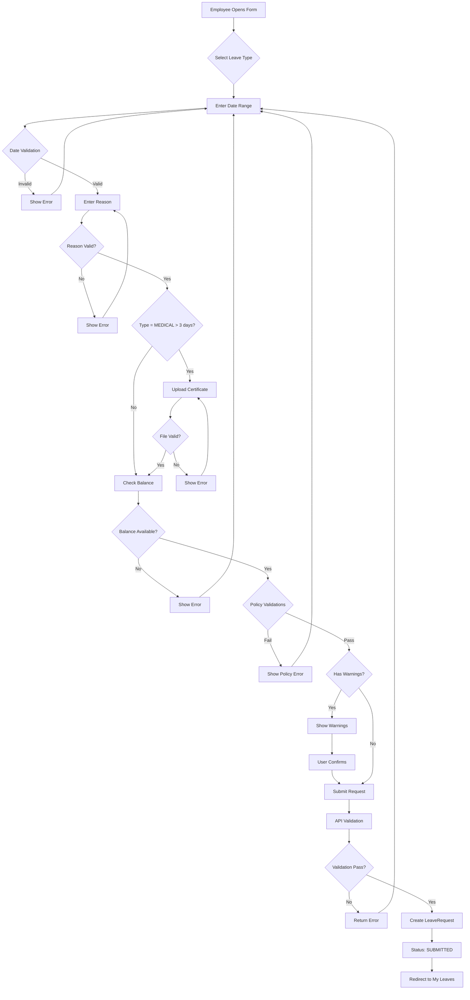

---

## 2. Approval Workflow State Machine

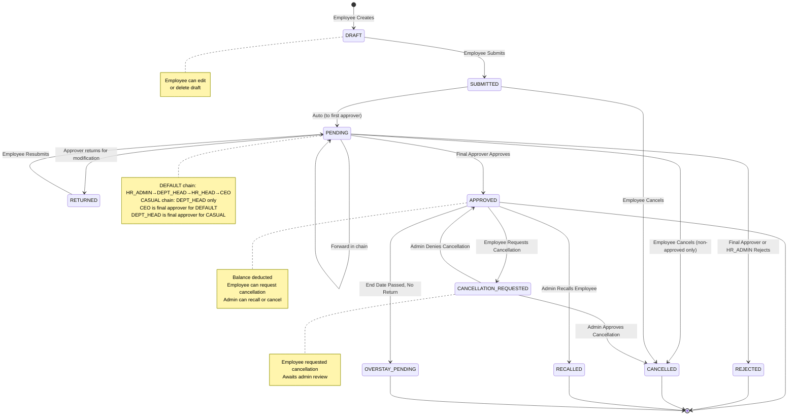

---

## 3. Approval Chain Flow

### DEFAULT Chain (EL, ML, and most leave types)

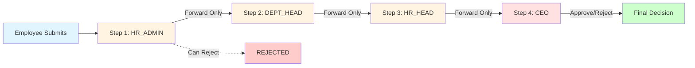

**Notes:**
- Chain must be followed **sequentially** - no skipping steps
- HR_ADMIN, DEPT_HEAD, HR_HEAD can only **FORWARD** to next role or **RETURN** for modification
- Only **CEO** (final approver) can **APPROVE**
- HR_ADMIN can **REJECT** as operational role; other intermediate roles cannot
- CEO can reject at any step when forwarded to them

### CASUAL Leave Chain

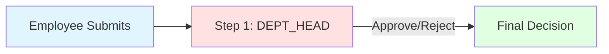

**Notes:**
- CASUAL leave uses **shortened chain** per Policy 6.10 exception
- DEPT_HEAD is the **final approver** for CASUAL leave
- HR_ADMIN is not in the CASUAL chain
- DEPT_HEAD can **APPROVE** or **REJECT** directly

---

## 4. Authentication Flow (with 2FA) ✨ Updated in v2.0

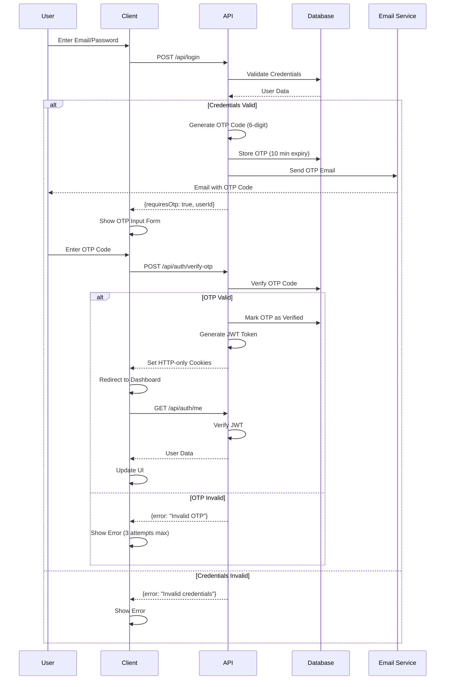

---

## 4a. 2FA OTP Verification Flow ✨ NEW in v2.0

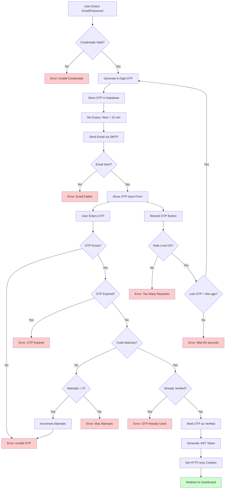

**Key Features:**
- **OTP Generation**: 6-digit random code
- **Expiration**: 10-minute validity window
- **Attempt Limiting**: Maximum 3 verification attempts per code
- **Rate Limiting**: Maximum 3 OTP requests per hour
- **Resend Cooldown**: 60-second cooldown between resend requests
- **Single-Use**: OTP can only be verified once
- **IP Tracking**: IP address logged for security audit

**Security Measures:**
- Database-backed (not in-memory) for reliability
- Automatic expiry enforcement
- Brute force protection via attempt limiting
- Rate limiting to prevent spam
- IP address logging for audit trail
- Single-use verification to prevent replay attacks

---

## 5. Balance Calculation Flow

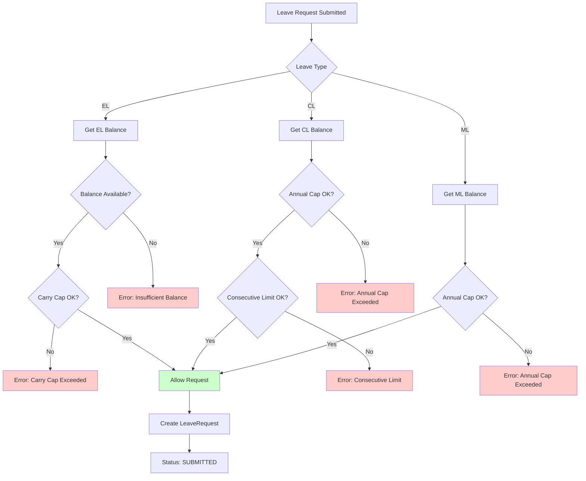

---

## 6. Policy Validation Flow

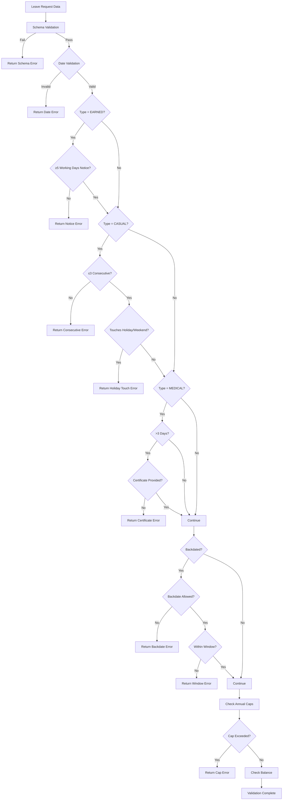

**Note:** Earned Leave requires **≥5 working days** notice per Policy 6.11 (not 15 days). Casual Leave and Quarantine Leave are exempt from advance notice requirements.

---

## 7. Cancellation Flow

### Employee Self-Cancellation

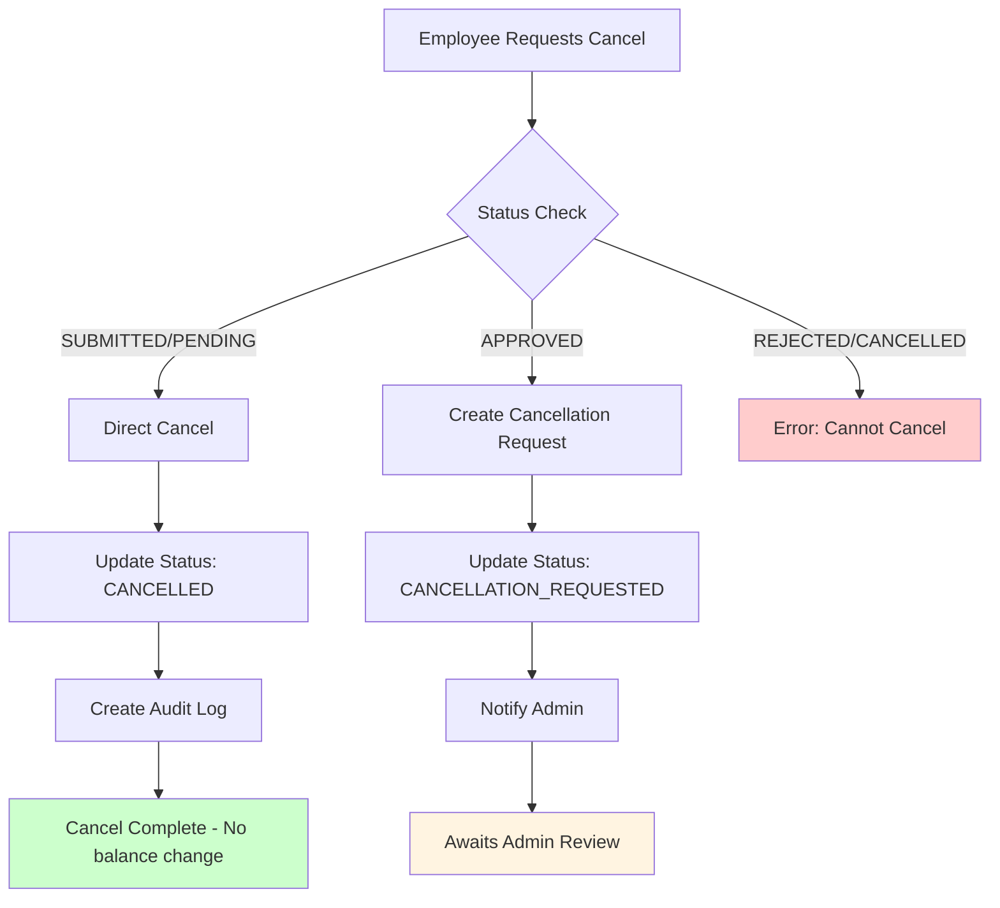

### Admin Cancellation/Review

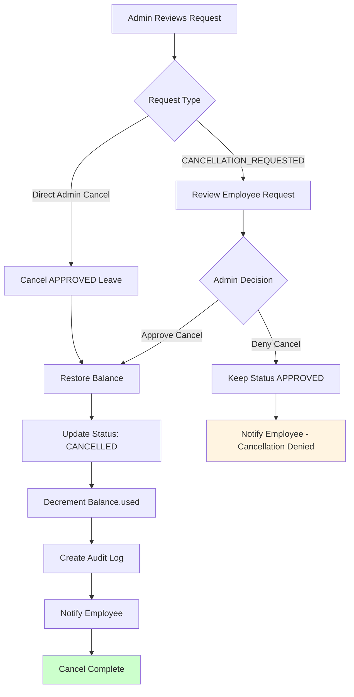

**Notes:**
- **Employee can self-cancel** SUBMITTED/PENDING requests → direct CANCELLED (no balance change)
- **Employee cannot self-cancel** APPROVED requests → must create CANCELLATION_REQUESTED
- **Admin roles** (HR_ADMIN, HR_HEAD, CEO) can cancel any APPROVED leave with balance restoration
- **Balance restoration** decrements `Balance.used` and updates `Balance.closing`
- Policy 6.8 and 6.9 allow management to cancel/recall leave for service exigencies

---

## 8. File Upload Flow

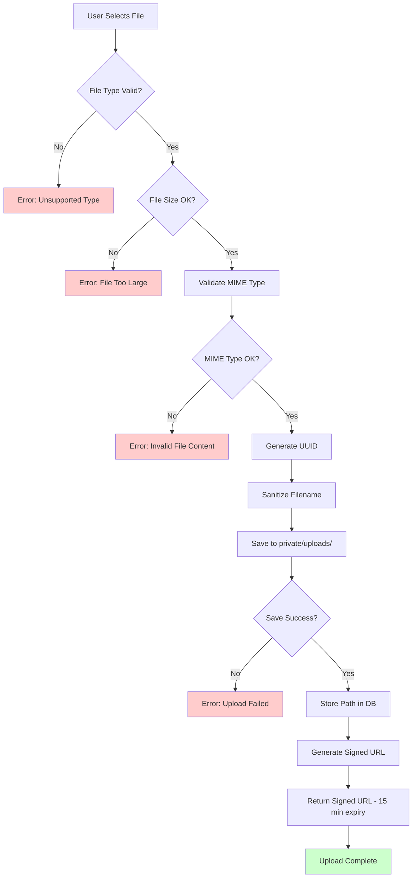

**Notes:**
- Files stored in **private/uploads/** (not web-accessible)
- **Signed URLs** generated with 15-minute expiry using HMAC signatures
- **MIME type validation** using file-type library (prevents spoofed extensions)
- **Download endpoint:** `GET /api/files/signed/[filename]` with signature verification
- **Max file size:** 5 MB
- **Allowed types:** PDF, JPG, JPEG, PNG

---

## 9. Error Handling Flow

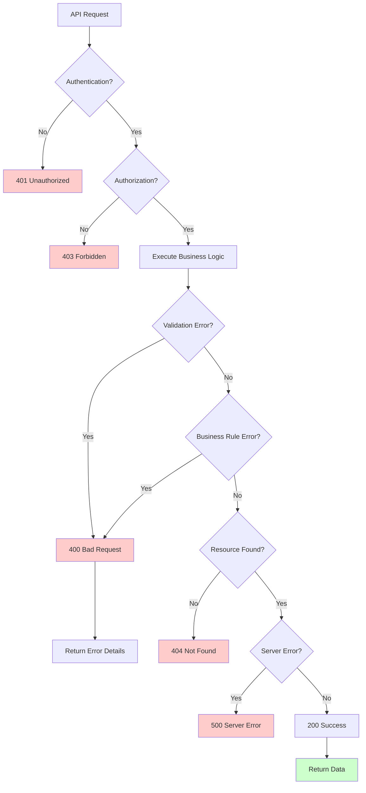

---

## 10. Date Validation Flow

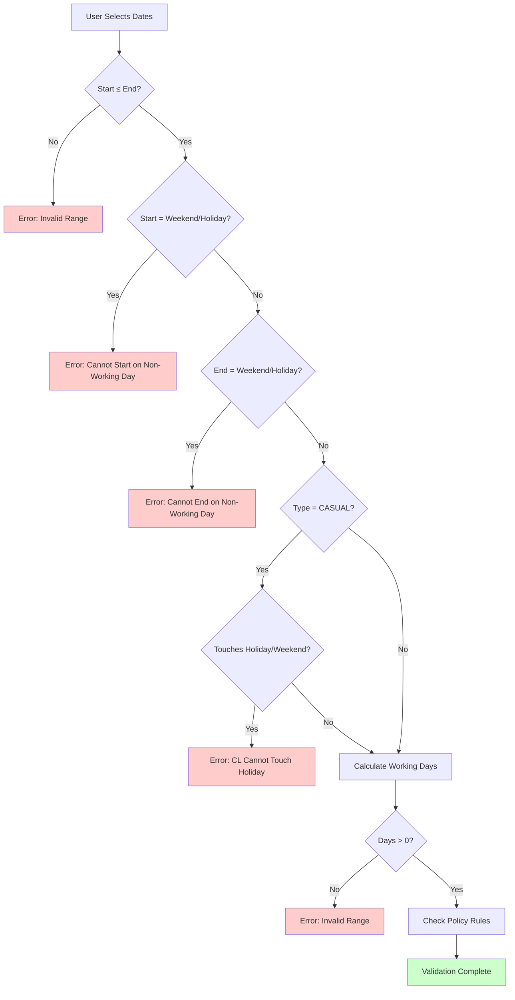

---

## 11. Holiday Detection Flow

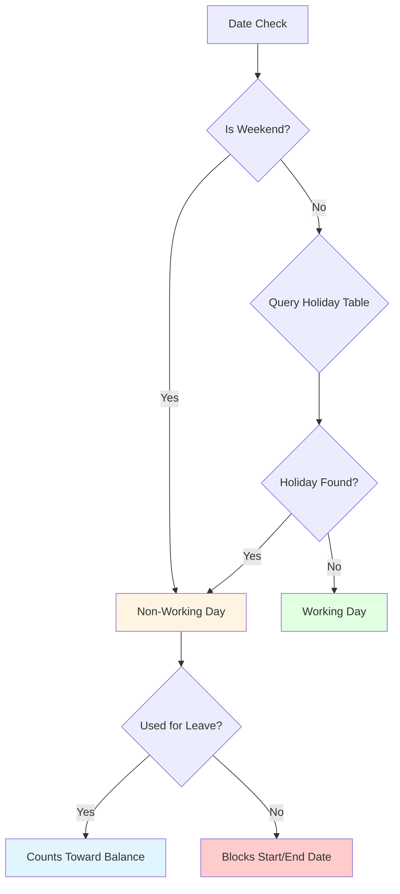

---

## 12. Role-Based Access Flow

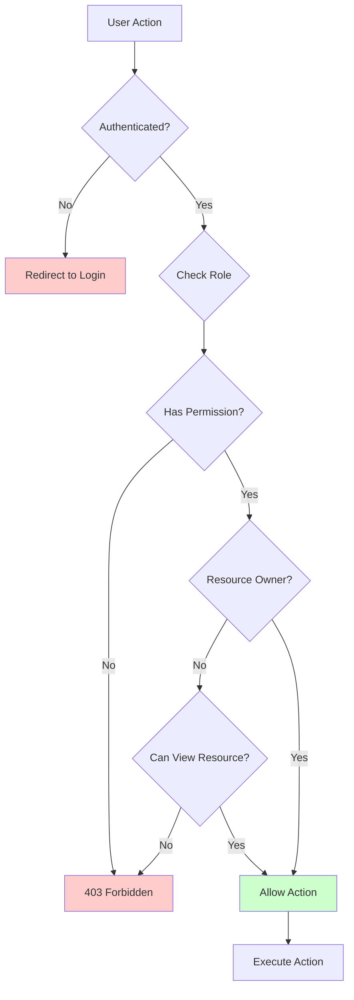

---

## Related Documentation

- **Approval Workflow**: [Policy Logic - Approval Workflow](./Policy%20Logic/06-Approval-Workflow-and-Chain.md)
- **Leave Application**: [Policy Logic - Application Rules](./Policy%20Logic/02-Leave-Application-Rules-and-Validation.md)
- **System Functionality**: [System Functionality](./05-System-Functionality.md)

---

**Document Version**: 2.0
**Last Updated**: January 2025
**Total Flow Charts**: 13 diagrams (12 from v1.0 + 1 new 2FA/OTP flow)
**New in v2.0**: Updated Authentication Flow with 2FA, New OTP Verification Flow Chart

