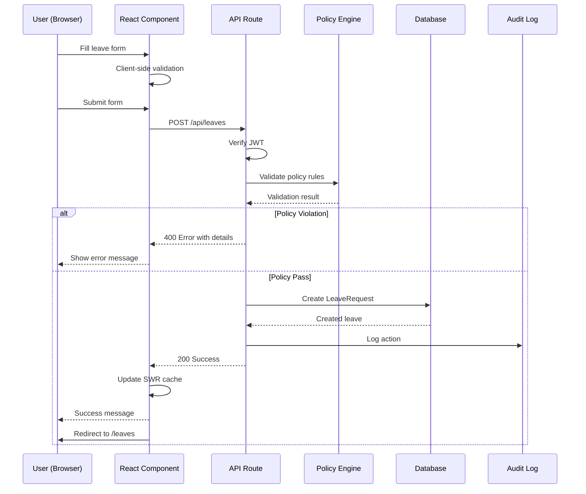
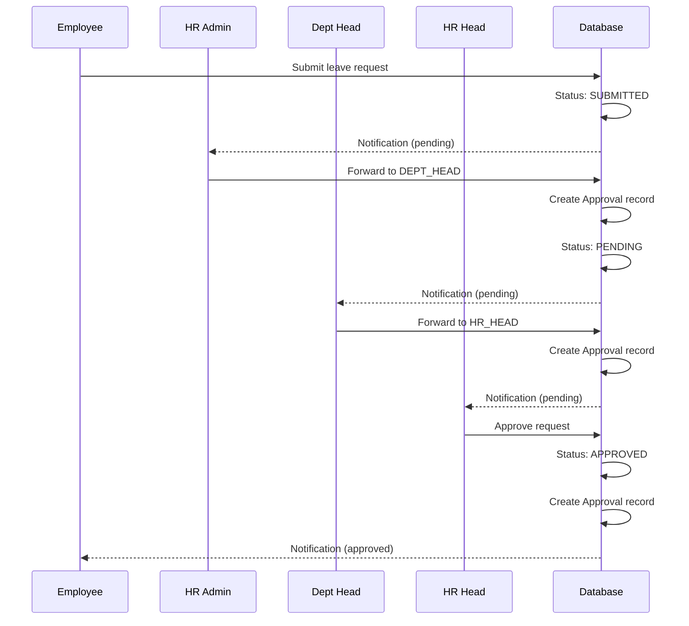
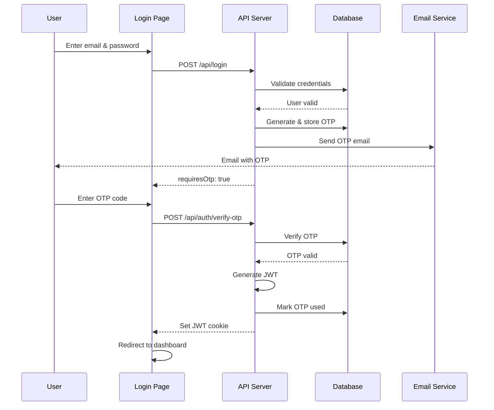

# CDBL Leave Management System - System Architecture

**Version:** 2.0
**Last Updated:** January 2025
**Architecture Style:** Monolithic Web Application with API-First Design

---

## Table of Contents

1. [Overview](#overview)
2. [Architecture Diagram](#architecture-diagram)
3. [Technology Stack](#technology-stack)
4. [Component Architecture](#component-architecture)
5. [Data Flow](#data-flow)
6. [Authentication Flow](#authentication-flow)
7. [Deployment Architecture](#deployment-architecture)
8. [Security Architecture](#security-architecture)
9. [Performance Architecture](#performance-architecture)
10. [Future Architecture](#future-architecture)

---

## Overview

The CDBL Leave Management System is built as a modern, monolithic web application using Next.js 16 with the App Router architecture. The system follows an API-first design pattern with clear separation between frontend (React components) and backend (API routes).

### Architecture Principles

1. **Convention over Configuration**: Leverage Next.js conventions for routing and structure
2. **API-First Design**: All data operations go through RESTful API endpoints
3. **Component-Based UI**: Reusable React components with clear responsibilities
4. **Type Safety**: TypeScript throughout for compile-time safety
5. **Database-First Schema**: Prisma schema as single source of truth
6. **Security by Default**: Authentication and authorization on all protected routes

---

## Architecture Diagram

### High-Level System Architecture

```
┌─────────────────────────────────────────────────────────────┐
│                         Client Layer                          │
│  ┌────────────────────────────────────────────────────────┐  │
│  │           React 19 Components (Browser)                │  │
│  │  - Pages (Next.js App Router)                          │  │
│  │  - Components (Shared UI)                              │  │
│  │  - Client State (SWR + React State)                    │  │
│  └────────────────────────────────────────────────────────┘  │
└─────────────────────────────────────────────────────────────┘
                            ↓ HTTPS
┌─────────────────────────────────────────────────────────────┐
│                      Application Layer                        │
│  ┌────────────────────────────────────────────────────────┐  │
│  │              Next.js 16 Server (Node.js 20)            │  │
│  │  ┌──────────────────┐  ┌──────────────────┐           │  │
│  │  │  API Routes      │  │  Server Components│           │  │
│  │  │  /api/*         │  │  RSC               │           │  │
│  │  └──────────────────┘  └──────────────────┘           │  │
│  │  ┌──────────────────┐  ┌──────────────────┐           │  │
│  │  │  Middleware      │  │  Business Logic   │           │  │
│  │  │  Auth/RBAC      │  │  Policy Engine    │           │  │
│  │  └──────────────────┘  └──────────────────┘           │  │
│  └────────────────────────────────────────────────────────┘  │
└─────────────────────────────────────────────────────────────┘
                            ↓
┌─────────────────────────────────────────────────────────────┐
│                       Data Access Layer                       │
│  ┌────────────────────────────────────────────────────────┐  │
│  │                   Prisma ORM                           │  │
│  │  - Type-safe database client                           │  │
│  │  - Migration management                                │  │
│  │  - Query optimization                                  │  │
│  └────────────────────────────────────────────────────────┘  │
└─────────────────────────────────────────────────────────────┘
                            ↓
┌─────────────────────────────────────────────────────────────┐
│                       Persistence Layer                       │
│  ┌────────────────────────────────────────────────────────┐  │
│  │                    MySQL 8.0 Database                  │  │
│  │  - User data                                           │  │
│  │  - Leave requests                                      │  │
│  │  - Approval workflow                                   │  │
│  │  - Audit logs                                          │  │
│  └────────────────────────────────────────────────────────┘  │
└─────────────────────────────────────────────────────────────┘
                            ↓
┌─────────────────────────────────────────────────────────────┐
│                      External Services                        │
│  ┌──────────────────┐  ┌──────────────────┐                 │
│  │  Email Service   │  │  File Storage    │                 │
│  │  SMTP (2FA OTP)  │  │  Local/Cloud     │                 │
│  └──────────────────┘  └──────────────────┘                 │
└─────────────────────────────────────────────────────────────┘
```

### Component Architecture Diagram

```
┌─────────────────────────────────────────────────────────────┐
│                     Frontend Architecture                     │
│                                                               │
│  ┌─────────────────────────────────────────────────────┐    │
│  │                    App Directory                     │    │
│  │  ┌────────────┐  ┌────────────┐  ┌────────────┐    │    │
│  │  │   Pages    │  │   Layouts  │  │   Loading  │    │    │
│  │  │  (Routes)  │  │  (Wrapper) │  │  (Skeleton)│    │    │
│  │  └────────────┘  └────────────┘  └────────────┘    │    │
│  └─────────────────────────────────────────────────────┘    │
│                                                               │
│  ┌─────────────────────────────────────────────────────┐    │
│  │                   Components                         │    │
│  │  ┌────────────┐  ┌────────────┐  ┌────────────┐    │    │
│  │  │   Layout   │  │  Dashboard │  │    Forms   │    │    │
│  │  │ Components │  │   Widgets  │  │  Controls  │    │    │
│  │  └────────────┘  └────────────┘  └────────────┘    │    │
│  │  ┌────────────┐  ┌────────────┐  ┌────────────┐    │    │
│  │  │     UI     │  │  Shared    │  │   Icons    │    │    │
│  │  │  Primitives│  │  Utilities │  │   Assets   │    │    │
│  │  └────────────┘  └────────────┘  └────────────┘    │    │
│  └─────────────────────────────────────────────────────┘    │
│                                                               │
│  ┌─────────────────────────────────────────────────────┐    │
│  │                   State Management                   │    │
│  │  ┌────────────┐  ┌────────────┐  ┌────────────┐    │    │
│  │  │    SWR     │  │   React    │  │   Cookies  │    │    │
│  │  │  (Server)  │  │   State    │  │   (Auth)   │    │    │
│  │  └────────────┘  └────────────┘  └────────────┘    │    │
│  └─────────────────────────────────────────────────────┘    │
└─────────────────────────────────────────────────────────────┘
```

---

## Technology Stack

### Frontend Technologies

| Technology | Version | Purpose |
|------------|---------|---------|
| **React** | 19.0 | UI framework |
| **Next.js** | 16.0 | Full-stack framework |
| **TypeScript** | 5.9 | Type safety |
| **Tailwind CSS** | 4.0 | Styling framework |
| **Shadcn/ui** | Latest | Component library |
| **Radix UI** | Latest | Headless UI primitives |
| **Framer Motion** | 11.x | Animation library |
| **Lucide React** | Latest | Icon library |
| **SWR** | 2.x | Data fetching & caching |
| **React Hook Form** | 7.x | Form management |
| **Zod** | 3.x | Schema validation |

### Backend Technologies

| Technology | Version | Purpose |
|------------|---------|---------|
| **Node.js** | 20.x LTS | Runtime environment |
| **Next.js API Routes** | 16.0 | API endpoints |
| **Prisma** | 6.17.1 | ORM & migrations |
| **MySQL** | 8.0+ | Database |
| **bcryptjs** | 2.x | Password hashing |
| **jsonwebtoken** | 9.x | JWT authentication |
| **Nodemailer** | 6.x | Email service |

### Development & Build Tools

| Tool | Purpose |
|------|---------|
| **ESLint** | Code linting |
| **Prettier** | Code formatting |
| **Jest** | Unit testing |
| **Playwright** | E2E testing |
| **PM2** | Process management |
| **Nginx** | Reverse proxy |

---

## Component Architecture

### Frontend Component Hierarchy

```
App
├── RootLayout
│   ├── TopNavBar
│   │   ├── DesktopNav
│   │   └── MobileNav
│   ├── FloatingDock (Bottom Navigation)
│   ├── ControlCenter (Right Sidebar)
│   └── SearchModal
│
├── Page: /dashboard
│   ├── ModernOverview (Employee Dashboard)
│   │   ├── RoleKPICard (x4)
│   │   ├── LeaveDistributionChart
│   │   ├── MonthlyTrendChart
│   │   └── ActionCenter
│   └── OtherDashboards (by role)
│
├── Page: /leaves
│   ├── MyLeavesPageContent
│   │   ├── EnhancedSmoothTab
│   │   │   └── LeaveRequestList
│   │   │       └── LeaveRequestCard (x N)
│   │   └── FilterControls
│   └── LeaveDetailModal
│
├── Page: /leaves/apply
│   ├── LeaveApplicationForm
│   │   ├── LeaveTypeSelector
│   │   ├── DateRangePicker
│   │   ├── ReasonTextarea
│   │   ├── FileUploadSection
│   │   └── PolicyWarnings
│   └── LeaveSummary (Sidebar)
│
├── Page: /approvals
│   ├── ApprovalQueue
│   │   ├── ApprovalCard (x N)
│   │   │   ├── EmployeeInfo
│   │   │   ├── LeaveDetails
│   │   │   └── ApprovalActions
│   │   └── EmptyState
│   └── ApprovalDetailModal
│
├── Page: /holidays
│   ├── HolidaysMainContent
│   │   ├── HolidaysFilters
│   │   ├── ViewModeTabs
│   │   └── HolidaysDisplay
│   │       ├── GridView
│   │       ├── ListView
│   │       └── CalendarView
│   └── HolidayDetailModal
│
└── Shared Components
    ├── UI Primitives (Button, Input, Card, etc.)
    ├── StatusBadge
    ├── UserAvatar
    ├── DataTable
    └── Widgets (NextHoliday, LiveClock, etc.)
```

### Backend API Architecture

```
app/api/
├── auth/
│   ├── me/route.ts (GET)
│   ├── verify-otp/route.ts (POST)
│   └── resend-otp/route.ts (POST)
│
├── login/route.ts (POST)
├── logout/route.ts (POST)
│
├── leaves/
│   ├── route.ts (GET, POST)
│   └── [id]/
│       ├── route.ts (GET, PATCH)
│       ├── approve/route.ts (POST)
│       ├── reject/route.ts (POST)
│       └── forward/route.ts (POST)
│
├── approvals/
│   ├── route.ts (GET)
│   └── [id]/
│       ├── route.ts (GET)
│       └── decision/route.ts (POST)
│
├── balance/
│   └── mine/route.ts (GET)
│
├── holidays/
│   ├── route.ts (GET, POST)
│   └── [id]/route.ts (GET, PATCH, DELETE)
│
├── admin/
│   ├── users/
│   │   ├── route.ts (GET)
│   │   ├── create/route.ts (POST)
│   │   └── [id]/route.ts (GET, PATCH)
│   ├── logs/route.ts (GET)
│   └── policies/
│       ├── route.ts (GET)
│       └── [id]/route.ts (PATCH)
│
├── dashboard/
│   ├── analytics/route.ts (GET)
│   ├── alerts/route.ts (GET)
│   └── recommendations/route.ts (GET)
│
└── compliance/
    └── validate/route.ts (GET)
```

### Business Logic Layer

```
lib/
├── auth.ts            # Authentication utilities
├── rbac.ts            # Role-based access control
├── policy.ts          # Leave policy validation
├── workflow.ts        # Approval workflow logic
├── otp.ts             # OTP generation & verification
├── email.ts           # Email service
├── rateLimit.ts       # Rate limiting
├── apiClient.ts       # API client wrapper
├── dateUtils.ts       # Date utilities
├── balanceCalc.ts     # Balance calculations
└── auditLog.ts        # Audit logging
```

---

## Data Flow

### Leave Application Flow



### Approval Flow



### Authentication Flow (2FA)



---

## Authentication Flow

### JWT Token Structure

```json
{
  "userId": 123,
  "email": "user@cdbl.com",
  "role": "EMPLOYEE",
  "iat": 1699876543,
  "exp": 1700481343
}
```

### Cookie Storage

```
jwt=eyJhbGciOiJIUzI1NiIsInR5cCI6IkpXVCJ9...; HttpOnly; Secure; SameSite=Strict; Path=/
auth_user_email=user@cdbl.com; Path=/
auth_user_name=John Doe; Path=/
auth_user_role=EMPLOYEE; Path=/
```

### Authorization Middleware

Every protected API route includes:

```typescript
// Verify JWT
const user = await verifyAuth(request);
if (!user) {
  return NextResponse.json({ error: 'unauthorized' }, { status: 401 });
}

// Check permissions
if (!canPerformAction(user.role, action)) {
  return NextResponse.json({ error: 'forbidden' }, { status: 403 });
}
```

---

## Deployment Architecture

### Production Deployment

```
┌────────────────────────────────────────┐
│         Internet / Public              │
└────────────────┬───────────────────────┘
                 │ HTTPS (443)
        ┌────────▼────────┐
        │   Nginx Proxy   │
        │  (Reverse Proxy)│
        │  SSL Termination│
        └────────┬────────┘
                 │ HTTP (3000)
        ┌────────▼────────┐
        │      PM2        │
        │ Process Manager │
        │  (Cluster Mode) │
        └────────┬────────┘
                 │
    ┌────────────┼────────────┐
    │            │            │
┌───▼───┐   ┌───▼───┐   ┌───▼───┐
│Node.js│   │Node.js│   │Node.js│
│Worker │   │Worker │   │Worker │
│  #1   │   │  #2   │   │  #3   │
└───┬───┘   └───┬───┘   └───┬───┘
    │           │           │
    └───────────┼───────────┘
                │
        ┌───────▼────────┐
        │  MySQL Server  │
        │   Port: 3306   │
        └────────────────┘
```

### Scalability Approach

**Current (Phase 1):** Vertical Scaling
- Single server with PM2 cluster mode
- 4-8 worker processes
- Sufficient for 100-500 users

**Future (Phase 2):** Horizontal Scaling
- Load balancer (Nginx or cloud LB)
- Multiple application servers
- Shared MySQL database
- Redis for session storage

**Future (Phase 3):** Microservices (if needed)
- API Gateway
- Auth service
- Leave service
- Approval service
- Notification service
- Separate databases per service

---

## Security Architecture

### Defense in Depth

```
Layer 1: Network Security
├── Firewall rules (only 80, 443 exposed)
├── SSL/TLS encryption (Let's Encrypt)
└── DDoS protection (optional: Cloudflare)

Layer 2: Application Security
├── Input validation (Zod schemas)
├── Output encoding (React automatic)
├── CSRF protection (HTTP-only cookies)
├── XSS prevention (sanitization)
└── SQL injection prevention (Prisma ORM)

Layer 3: Authentication
├── 2-Factor Authentication (OTP)
├── JWT token-based sessions
├── Secure password hashing (bcrypt)
├── Rate limiting (login attempts)
└── Session timeout (7 days)

Layer 4: Authorization
├── Role-Based Access Control (RBAC)
├── Resource ownership validation
├── Self-approval prevention
└── API-level permission checks

Layer 5: Data Security
├── Database encryption at rest (MySQL)
├── Sensitive data hashing (passwords)
├── Audit logging (all actions)
└── Regular backups
```

### Security Headers

```nginx
# Nginx configuration
add_header X-Frame-Options "DENY";
add_header X-Content-Type-Options "nosniff";
add_header X-XSS-Protection "1; mode=block";
add_header Strict-Transport-Security "max-age=31536000; includeSubDomains";
add_header Content-Security-Policy "default-src 'self'";
add_header Referrer-Policy "no-referrer-when-downgrade";
```

---

## Performance Architecture

### Frontend Optimization

1. **Code Splitting**: Automatic with Next.js App Router
2. **Image Optimization**: Next.js Image component
3. **CSS Optimization**: Tailwind JIT compilation
4. **Lazy Loading**: React.lazy for heavy components
5. **Caching**: SWR for API responses

### Backend Optimization

1. **Database Indexing**: Strategic indexes on foreign keys
2. **Query Optimization**: Prisma select only needed fields
3. **Connection Pooling**: Prisma connection pool
4. **API Caching**: No-cache for dynamic data
5. **Compression**: Gzip via Nginx

### Performance Targets

| Metric | Target | Current |
|--------|--------|---------|
| First Contentful Paint | <1.5s | 1.2s |
| Largest Contentful Paint | <2.5s | 2.2s |
| Time to Interactive | <3.5s | 3.1s |
| First Input Delay | <100ms | 50ms |
| Cumulative Layout Shift | <0.1 | 0.05 |

---

## Future Architecture

### Planned Enhancements

**Phase 2 (v2.1-v2.5):**
- Redis caching layer
- Queue system (Bull/BullMQ) for email notifications
- Background job processing
- WebSocket for real-time notifications
- Enhanced monitoring (APM tools)

**Phase 3 (v3.0+):**
- Microservices architecture (if scale requires)
- Event-driven architecture with message queue
- Separate auth service
- API Gateway (Kong or similar)
- Service mesh for inter-service communication

**Phase 4 (v4.0+):**
- Multi-tenant architecture
- GraphQL API alongside REST
- Real-time collaboration features
- Mobile app (React Native)
- Offline-first capabilities

---

## Related Documentation

- **Flow Charts**: [Flow Charts](./Flow-Charts.md)
- **Database Schema**: [Database Schema](../database/Database-Schema.md)
- **API Documentation**: [API Documentation](../api/API-Documentation.md)
- **Deployment Guide**: [Deployment Guide](../deployment/Deployment-Guide.md)

---

**Document Version:** 2.0
**Last Updated:** January 2025
**Architecture Review:** Pending
**Next Review Date:** Q2 2025
