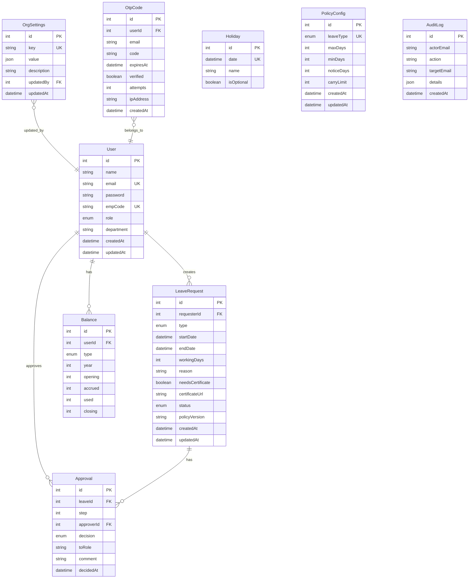

# CDBL Leave Management System - Entity Relationship Diagram

**Version:** 2.0
**Last Updated:** January 2025
**Database:** MySQL 8.0+

---

## Table of Contents

1. [Overview](#overview)
2. [Complete ERD](#complete-erd)
3. [Entity Descriptions](#entity-descriptions)
4. [Relationships](#relationships)
5. [Cardinality](#cardinality)
6. [Indexes & Performance](#indexes--performance)
7. [Data Integrity](#data-integrity)

---

## Overview

This document provides visual representations of the database schema using Entity-Relationship Diagrams (ERD). The CDBL Leave Management System uses 8 core tables with well-defined relationships.

### Database Summary

- **Total Tables**: 8
- **Total Relationships**: 7 foreign keys
- **Database Engine**: MySQL 8.0 (InnoDB)
- **Character Set**: utf8mb4
- **Collation**: utf8mb4_unicode_ci

---

## Complete ERD

### Full System ERD



---

## Entity Descriptions

### Core Entities

#### User
**Purpose:** Central entity representing all system users (employees and administrators)

**Key Attributes:**
- `id`: Primary key (auto-increment)
- `email`: Unique identifier for login
- `empCode`: Optional employee code (unique if provided)
- `role`: User role (EMPLOYEE, DEPT_HEAD, HR_ADMIN, HR_HEAD, CEO)
- `password`: Bcrypt hashed password

**Relationships:**
- Creates many LeaveRequests
- Has many Balances (one per leave type per year)
- Makes many Approvals

---

#### LeaveRequest
**Purpose:** Represents a leave application submitted by an employee

**Key Attributes:**
- `id`: Primary key
- `requesterId`: Foreign key to User
- `type`: Leave type (EARNED, CASUAL, MEDICAL, etc.)
- `status`: Current status (DRAFT, SUBMITTED, PENDING, APPROVED, REJECTED, CANCELLED)
- `workingDays`: Calendar days requested (inclusive)
- `policyVersion`: Policy version in effect when created

**Relationships:**
- Belongs to one User (requester)
- Has many Approvals (approval chain)

**Business Rules:**
- Status flows: DRAFT → SUBMITTED → PENDING → {APPROVED | REJECTED | CANCELLED}
- Cannot delete approved or rejected requests
- Medical certificates required for ML > 3 days

---

#### Approval
**Purpose:** Tracks approval workflow steps and decisions

**Key Attributes:**
- `id`: Primary key
- `leaveId`: Foreign key to LeaveRequest
- `approverId`: Foreign key to User (who made decision)
- `step`: Step number in approval chain (1-4)
- `decision`: PENDING, FORWARDED, APPROVED, or REJECTED
- `toRole`: Role forwarded to (if decision = FORWARDED)

**Relationships:**
- Belongs to one LeaveRequest
- Belongs to one User (approver)

**Business Rules:**
- Steps are sequential (1, 2, 3, 4)
- Multiple FORWARDED records for one leave
- Only one APPROVED or REJECTED decision per leave

---

#### Balance
**Purpose:** Tracks leave balances per user, per type, per year

**Key Attributes:**
- `id`: Primary key
- `userId`: Foreign key to User
- `type`: Leave type (EARNED, CASUAL, MEDICAL)
- `year`: Calendar year
- `opening`: Carry-forward from previous year
- `accrued`: Current year allocation
- `used`: Days consumed
- `closing`: Calculated: (opening + accrued) - used

**Relationships:**
- Belongs to one User

**Unique Constraint:**
- Composite unique: (userId, type, year)

**Business Rules:**
- One balance record per user/type/year combination
- Opening balance only for EARNED leave (others start at 0)
- Accrued balance added monthly for EL

---

### Supporting Entities

#### Holiday
**Purpose:** Company holiday calendar

**Key Attributes:**
- `id`: Primary key
- `date`: Unique date
- `name`: Holiday name
- `isOptional`: Optional holiday flag

**Unique Constraint:**
- `date` must be unique

**Business Rules:**
- Used to exclude non-working days from leave calculations
- CL cannot touch holidays/weekends
- Leave cannot start or end on holidays

---

#### PolicyConfig
**Purpose:** Configurable policy settings per leave type

**Key Attributes:**
- `id`: Primary key
- `leaveType`: Unique leave type
- `maxDays`: Maximum days allowed
- `noticeDays`: Advance notice requirement
- `carryLimit`: Carry-forward limit

**Status:** Model exists but currently unused (policies hardcoded in lib/policy.ts)

**Future Use:** Dynamic policy configuration via admin panel

---

#### AuditLog
**Purpose:** Immutable audit trail of all system actions

**Key Attributes:**
- `id`: Primary key
- `actorEmail`: Email of user who performed action
- `action`: Action type (LEAVE_APPROVE, LEAVE_REJECT, etc.)
- `targetEmail`: Email of affected user
- `details`: JSON with additional context

**Relationships:** None (intentionally decoupled for immutability)

**Index:**
- `createdAt` indexed for time-based queries

---

#### OrgSettings
**Purpose:** Organization-wide configuration settings

**Key Attributes:**
- `id`: Primary key
- `key`: Unique setting key
- `value`: JSON value
- `updatedBy`: Foreign key to User

**Example Settings:**
- Backdate permissions per leave type
- Annual caps
- System-wide toggles

---

#### OtpCode
**Purpose:** 2FA OTP codes for authentication

**Key Attributes:**
- `id`: Primary key
- `userId`: Foreign key to User
- `code`: 6-digit OTP
- `expiresAt`: Expiration timestamp (10 minutes)
- `verified`: Used flag
- `attempts`: Failed verification count

**Relationships:**
- Belongs to one User

**Business Rules:**
- Expires after 10 minutes
- Maximum 3 verification attempts
- Single use only (marked verified after success)
- Cleaned up after use or expiration

---

## Relationships

### Relationship Matrix

| From | To | Relationship Type | Cardinality | Foreign Key | On Delete |
|------|-----|-------------------|-------------|-------------|-----------|
| LeaveRequest | User | Many-to-One | N:1 | requesterId | CASCADE |
| Approval | LeaveRequest | Many-to-One | N:1 | leaveId | CASCADE |
| Approval | User | Many-to-One | N:1 | approverId | RESTRICT |
| Balance | User | Many-to-One | N:1 | userId | CASCADE |
| OrgSettings | User | Many-to-One | N:1 | updatedBy | SET NULL |
| OtpCode | User | Many-to-One | N:1 | userId | CASCADE |

### Relationship Descriptions

#### User → LeaveRequest (1:N)
**Relationship:** One user can create many leave requests

```sql
FOREIGN KEY (requesterId) REFERENCES User(id) ON DELETE CASCADE
```

**Cascade Behavior:**
- When user is deleted, all their leave requests are deleted
- Rationale: Leave requests belong to the user

---

#### LeaveRequest → Approval (1:N)
**Relationship:** One leave request can have many approval records

```sql
FOREIGN KEY (leaveId) REFERENCES LeaveRequest(id) ON DELETE CASCADE
```

**Cascade Behavior:**
- When leave request is deleted, all approvals are deleted
- Rationale: Approvals are part of leave lifecycle

---

#### User → Approval (1:N)
**Relationship:** One user can make many approval decisions

```sql
FOREIGN KEY (approverId) REFERENCES User(id) ON DELETE RESTRICT
```

**Cascade Behavior:**
- Cannot delete user if they have approval records
- Rationale: Preserve audit trail

---

#### User → Balance (1:N)
**Relationship:** One user has many balance records (different types/years)

```sql
FOREIGN KEY (userId) REFERENCES User(id) ON DELETE CASCADE
```

**Cascade Behavior:**
- When user is deleted, all their balances are deleted
- Rationale: Balances belong to the user

---

#### User → OtpCode (1:N)
**Relationship:** One user can have many OTP codes (over time)

```sql
FOREIGN KEY (userId) REFERENCES User(id) ON DELETE CASCADE
```

**Cascade Behavior:**
- When user is deleted, all their OTP codes are deleted
- Rationale: OTP codes belong to the user

---

## Cardinality

### Visual Cardinality Diagram

```
User (1) ──────< (N) LeaveRequest
  │
  └─────< (N) Balance
  │
  └─────< (N) Approval (as approver)
  │
  └─────< (N) OtpCode

LeaveRequest (1) ──────< (N) Approval

OrgSettings (N) >────── (1) User (updatedBy)
```

### Cardinality Rules

| Entity A | Cardinality | Entity B | Description |
|----------|-------------|----------|-------------|
| User | 1:N | LeaveRequest | One user, many leave requests |
| User | 1:N | Balance | One user, many balances (per type/year) |
| User | 1:N | Approval | One user, many approval decisions |
| User | 1:N | OtpCode | One user, many OTP codes (historical) |
| LeaveRequest | 1:N | Approval | One leave, many approval steps |
| OrgSettings | N:1 | User | Many settings, updated by one user |

---

## Indexes & Performance

### Primary Keys (Clustered Indexes)

All tables have auto-increment `id` as primary key:

```sql
PRIMARY KEY (id)
```

### Unique Indexes

```sql
-- User table
UNIQUE INDEX User_email_key ON User(email)
UNIQUE INDEX User_empCode_key ON User(empCode)

-- Balance table
UNIQUE INDEX Balance_userId_type_year_key ON Balance(userId, type, year)

-- Holiday table
UNIQUE INDEX Holiday_date_key ON Holiday(date)

-- PolicyConfig table
UNIQUE INDEX PolicyConfig_leaveType_key ON PolicyConfig(leaveType)

-- OrgSettings table
UNIQUE INDEX OrgSettings_key_key ON OrgSettings(key)
```

### Foreign Key Indexes

```sql
-- Approval table
INDEX Approval_leaveId_idx ON Approval(leaveId)
INDEX Approval_approverId_idx ON Approval(approverId)

-- OtpCode table
INDEX OtpCode_userId_idx ON OtpCode(userId)
INDEX OtpCode_email_idx ON OtpCode(email)

-- AuditLog table
INDEX AuditLog_createdAt_idx ON AuditLog(createdAt)
```

### Composite Indexes

```sql
-- Balance table (composite unique)
UNIQUE INDEX ON Balance(userId, type, year)
```

### Query Performance

**Optimized Queries:**
- User lookup by email: O(log n) via unique index
- Leave requests by user: O(log n) via requesterId index
- Approvals by leave: O(log n) via leaveId index
- Balance lookup: O(1) via composite unique index

**Potential Bottlenecks:**
- Full table scans on AuditLog (mitigated by createdAt index)
- Large JOIN operations (acceptable for current scale)

---

## Data Integrity

### Constraints

#### Primary Key Constraints

All tables enforce primary key uniqueness and not-null:

```sql
id INT NOT NULL AUTO_INCREMENT PRIMARY KEY
```

#### Foreign Key Constraints

All foreign keys enforce referential integrity:

```sql
-- Example: LeaveRequest.requesterId must exist in User.id
CONSTRAINT LeaveRequest_requesterId_fkey
  FOREIGN KEY (requesterId)
  REFERENCES User(id)
  ON DELETE CASCADE
```

#### Unique Constraints

Prevent duplicate data:

```sql
-- User email must be unique
CONSTRAINT User_email_key UNIQUE (email)

-- Balance per user/type/year must be unique
CONSTRAINT Balance_userId_type_year_key UNIQUE (userId, type, year)
```

#### Not-Null Constraints

Required fields enforced:

```sql
-- User must have name and email
name VARCHAR(191) NOT NULL
email VARCHAR(191) NOT NULL

-- LeaveRequest must have type and dates
type ENUM(...) NOT NULL
startDate DATETIME(3) NOT NULL
endDate DATETIME(3) NOT NULL
```

#### Check Constraints

Enforced at application level (not database level in MySQL):

- `startDate <= endDate`
- `workingDays > 0`
- `opening >= 0, accrued >= 0, used >= 0`

---

### Cascade Behaviors

#### ON DELETE CASCADE

When parent record is deleted, child records are automatically deleted:

```sql
-- Delete user → delete all their leave requests
LeaveRequest.requesterId → User.id (CASCADE)

-- Delete leave → delete all approval records
Approval.leaveId → LeaveRequest.id (CASCADE)

-- Delete user → delete all balances
Balance.userId → User.id (CASCADE)

-- Delete user → delete all OTP codes
OtpCode.userId → User.id (CASCADE)
```

#### ON DELETE RESTRICT

Cannot delete parent if child records exist:

```sql
-- Cannot delete user if they have made approval decisions
Approval.approverId → User.id (RESTRICT)
```

#### ON DELETE SET NULL

Set foreign key to NULL when parent is deleted:

```sql
-- If updatedBy user deleted, set to NULL
OrgSettings.updatedBy → User.id (SET NULL)
```

---

## Database Diagram Legend

### Symbols Used

```
PK  = Primary Key
FK  = Foreign Key
UK  = Unique Key
||  = One (exactly one)
o{  = Many (zero or more)
}o  = Many-to-One relationship
```

### Relationship Notation

```
A ||--o{ B   = One A has many B (1:N)
A }o--|| B   = Many A belong to one B (N:1)
A ||--|| B   = One-to-One relationship (1:1)
A }o--o{ B   = Many-to-Many relationship (N:M)
```

---

## Related Documentation

- **Database Schema**: [Database Schema](./Database-Schema.md)
- **System Architecture**: [System Architecture](../architecture/System-Architecture.md)
- **API Documentation**: [API Documentation](../api/API-Documentation.md)

---

**Document Version:** 2.0
**Last Updated:** January 2025
**Database Version:** MySQL 8.0+
**Prisma Version:** 6.17.1
**Total Entities:** 9 tables
**Total Relationships:** 7 foreign keys
